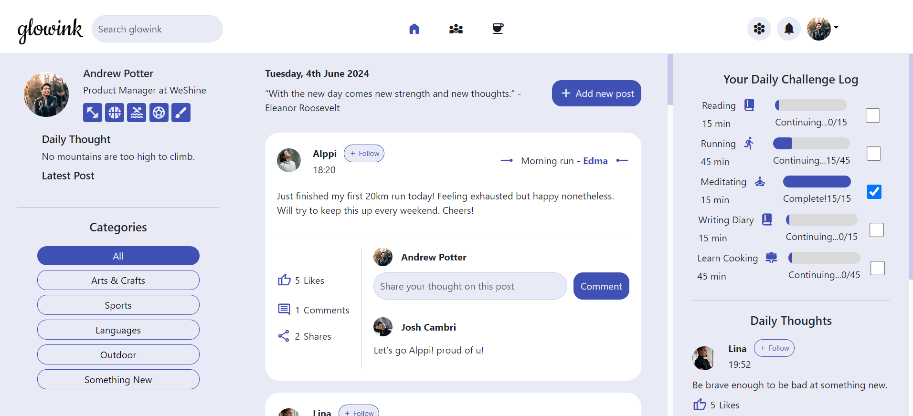

# Glowink Social Media Web App

A self help community web application built using HTML, CSS, Bootstrap, and Vue.js frameworks. The app allows users to create, comment, and filter posts, offering a simple social media experience. The project is currently in progress, with plans for further development.

## Features

- Login to the web app (hardcoded credentials: 'testuser' for username and 'test12345' for password)
- Create Post: Test users can create new posts.
- Comment on Posts: Users can comment on existing posts.
- Filter Posts: Posts can be filtered based on categories.
- Read Content: Users can read posts and daily thoughts from other sample users.

## Technologies Used

- HTML & CSS: Web structure and styling.
- Bootstrap: Used for login page design and layout.
- Vue.js: Reactive JavaScript framework for dynamic UI components.

## Project Status

This project is currently under development. Future enhancements include:

- Connect the application data to a database for multi-user, real-time functionality.
- Implement responsive design to ensure the app is adaptable to different screen sizes.
- Implement follow, like, and share functionalities for posts.
- Add CRUD functionalities for daily thoughts and daily challenges.
- Write additional components for the socials and challenges pages.

## Screenshots

